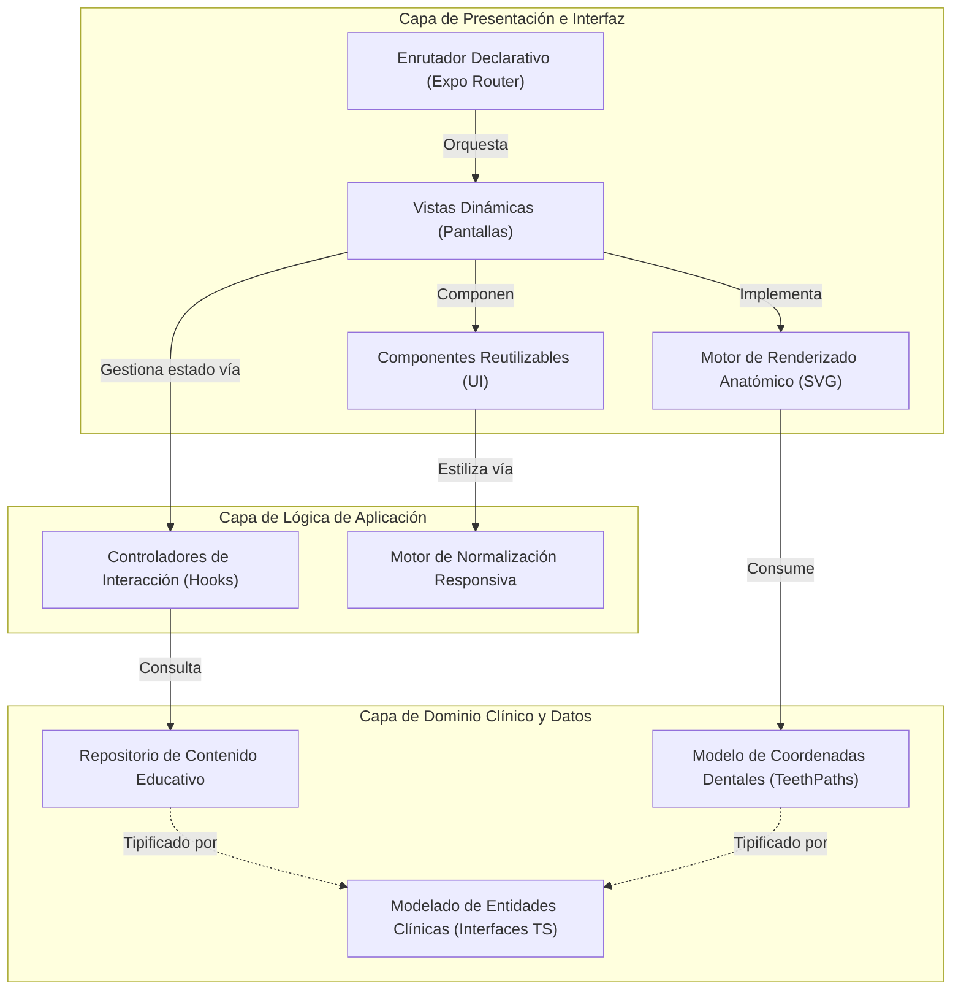
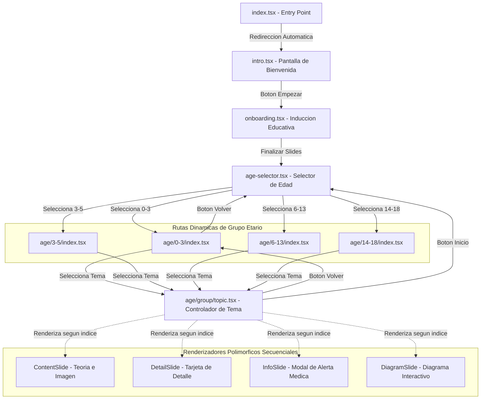

# INFORME TÉCNICO FINAL DE DESARROLLO
## "Cartilla Dental Hemofilia"

---

**Trabajo de Grado:**  
*Diseño, desarrollo e implementación de una aplicación móvil para el cuidado oral del paciente pediátrico con hemofilia: enfoque de ingeniería de software y usabilidad*

**Estudiante:** Breyner Ismael Ciro Otero  
**Evaluador:** Prof. Germán Jairo Hernández  
**Fecha:** Junio de 2026

---

## 1. INTRODUCCIÓN

El presente informe técnico documenta los resultados finales del diseño, arquitectura y desarrollo de la aplicación móvil **"Cartilla Dental Hemofilia"**, una herramienta educativa e interactiva orientada al cuidado oral del paciente pediátrico con hemofilia. La aplicación fue construida para mejorar la adherencia al tratamiento y fortalecer la comunicación entre cuidadores y profesionales de la salud, aplicando rigurosamente principios de ingeniería de software y metodologías centradas en el usuario.

---

## 2. OBJETIVO GENERAL

Diseñar, desarrollar e implementar una aplicación móvil para el cuidado oral del paciente pediátrico con hemofilia, aplicando principios de ingeniería de software y metodologías centradas en el usuario para crear una herramienta educativa e interactiva que mejore la adherencia al tratamiento y fortalezca la comunicación entre cuidadores y profesionales de la salud.

## 3. OBJETIVOS ESPECÍFICOS

1. Analizar los requerimientos funcionales y no funcionales de la aplicación mediante técnicas de ingeniería de software, considerando las necesidades específicas de cuidadores de pacientes pediátricos con hemofilia y los estándares de calidad para aplicaciones médicas.
2. Diseñar la arquitectura de software de la aplicación móvil aplicando patrones de diseño apropiados, considerando aspectos de seguridad, escalabilidad y usabilidad específicos para el dominio de la salud pediátrica.
3. Evaluar la usabilidad de la aplicación mediante pruebas con usuarios finales, aplicando métricas de experiencia de usuario (UX) y principios de diseño centrado en el usuario para garantizar la efectividad y satisfacción del sistema.

---

## 4. STACK TECNOLÓGICO

| Componente | Tecnología | Versión |
|---|---|---|
| **Framework principal** | React Native (Expo) | SDK 55 |
| **Lenguaje** | TypeScript | ^5.3.3 |
| **Routing/Navegación** | expo-router (file-based) | ~55.0.14 |
| **Gráficos vectoriales** | react-native-svg | 15.15.3 |
| **Animaciones** | react-native-reanimated | 4.2.1 |
| **Fuentes** | expo-font + Google Fonts | ~55.0.7 |
| **Bundler** | Metro | Integrado Expo |
| **Transpilación** | Babel (babel-preset-expo) | ^7.25.2 |
| **Plataformas destino** | Android, iOS, Web | Multiplataforma |

### 4.1 Justificación del Stack

- **React Native + Expo:** Permite el desarrollo multiplataforma (Android, iOS y Web) compartiendo una única base de código, optimizando los tiempos de desarrollo. Expo facilita la configuración del entorno, la compilación y el despliegue del software.
- **TypeScript:** Incorpora tipado estático, lo cual reduce significativamente los errores en tiempo de desarrollo y asegura la mantenibilidad del código a largo plazo.
- **expo-router:** Implementa el enrutamiento basado en el sistema de archivos (*file-based routing*), lo que simplifica la arquitectura de navegación y facilita su escalabilidad.

---

## 5. CUMPLIMIENTO DE REQUERIMIENTOS

El desarrollo de la aplicación se encuentra **100% finalizado**, cumpliendo satisfactoriamente con la totalidad de los requerimientos funcionales y no funcionales establecidos al inicio del proyecto.

### 5.1 Requerimientos Funcionales

| ID | Requerimiento | Prioridad | Estado |
|---|---|---|---|
| RF-01 | Despliegue de una pantalla de introducción con información general sobre hemofilia y odontología | Alta | ✅ Implementado |
| RF-02 | Integración de un flujo de onboarding educativo con slides informativos sobre hemofilia y coagulación | Alta | ✅ Implementado |
| RF-03 | Selección del grupo de edad del paciente pediátrico (0-3, 3-5, 6-13, 14-18 años) | Alta | ✅ Implementado |
| RF-04 | Presentación de contenido educativo personalizado según el grupo de edad seleccionado | Alta | ✅ Implementado |
| RF-05 | Organización de temas clínicos por categorías (erupción dental, higiene oral, sangrado, trauma) | Alta | ✅ Implementado |
| RF-06 | Integración de un diagrama dental interactivo 2D con representación anatómica de los arcos maxilar superior e inferior | Alta | ✅ Implementado |
| RF-07 | Selección de dientes individuales con despliegue de información sobre tipo de diente y edad de erupción | Alta | ✅ Implementado |
| RF-08 | Visualización de alertas y recomendaciones médicas con indicadores visuales de urgencia | Media | ✅ Implementado |
| RF-09 | Navegación secuencial entre slides de contenido educativo con controles de avance y retroceso | Alta | ✅ Implementado |
| RF-10 | Despliegue de información detallada en tarjetas con formato visual diferenciado | Media | ✅ Implementado |
| RF-11 | Inclusión de logos institucionales (HOMI, Universidad Nacional) en la interfaz | Media | ✅ Implementado |
| RF-12 | Soporte nativo para contenido multimedia (imágenes clínicas, ilustraciones educativas) | Alta | ✅ Implementado |

### 5.2 Requerimientos No Funcionales

| ID | Requerimiento | Categoría | Estado |
|---|---|---|---|
| RNF-01 | Ejecución nativa en Android e iOS utilizando una única base de código | Portabilidad | ✅ Cumplido |
| RNF-02 | Adaptabilidad de la interfaz a diferentes tamaños de pantalla (diseño responsivo) | Usabilidad | ✅ Cumplido |
| RNF-03 | Escalado proporcional de fuentes tipográficas según el ancho del dispositivo | Usabilidad | ✅ Cumplido |
| RNF-04 | Carga previa de fuentes personalizadas y recursos visuales (splash screen) | Rendimiento | ✅ Cumplido |
| RNF-05 | Respuesta fluida a interacciones táctiles mediante animaciones basadas en físicas | Usabilidad | ✅ Cumplido |
| RNF-06 | Tipado estático estricto del código fuente para prevención de errores | Mantenibilidad | ✅ Cumplido |
| RNF-07 | Fidelidad visual estricta frente a los prototipos de diseño de Figma | Usabilidad | ✅ Cumplido |
| RNF-08 | Validación clínica del contenido médico por profesionales de la salud | Confiabilidad | ✅ Cumplido |
| RNF-09 | Bloqueo de orientación en modo vertical (portrait) para garantizar integridad visual | Usabilidad | ✅ Cumplido |
| RNF-10 | Reutilización de componentes gobernados por un sistema de diseño centralizado | Mantenibilidad | ✅ Cumplido |
| RNF-11 | Compatibilidad integral con la nueva arquitectura de React Native | Rendimiento | ✅ Cumplido |

---

## 6. ARQUITECTURA DE SOFTWARE

### 6.1 Patrón Arquitectónico (Arquitectura en Capas)

La aplicación implementa una **Arquitectura en Capas (Layered Architecture)** fundamentada en el modelo de componentes, estableciendo una separación estricta de responsabilidades entre la visualización, la lógica de interacción y los repositorios de información clínica. Este enfoque garantiza alta cohesión y bajo acoplamiento.

El diseño se estructura lógicamente en tres niveles:
1. **Capa de Presentación e Interfaz:** Responsable de la interacción con el usuario, orquestada por el sistema de rutas basadas en archivos. Incluye los componentes visuales genéricos y el renderizador interactivo de anatomía dental.
2. **Capa de Lógica de Aplicación:** Gestiona el estado local, el procesamiento de las animaciones físicas y la adaptación matemática de los estilos (escalado tipográfico responsivo).
3. **Capa de Dominio Clínico y Datos:** Actúa como la fuente de verdad estática del sistema. Aquí residen todas las estructuras de datos que representan el conocimiento odontológico y los metadatos vectoriales del diagrama, aislados completamente de la lógica de renderizado.

### 6.2 Patrones de Diseño Implementados

| Patrón | Implementación | Ubicación |
|---|---|---|
| **Component Pattern** | Desarrollo de componentes reutilizables con propiedades tipadas | `src/components/` |
| **File-based Routing** | Sistema de navegación declarativa basada en la jerarquía de directorios | `app/` |
| **Dynamic Routing** | Rutas parametrizadas dinámicamente (`[group]`, `[topic]`) para la inyección de contenido | `app/age/[group]/[topic].tsx` |
| **Design Tokens** | Variables de diseño para la centralización estandarizada de colores y tipografía | `src/theme/` |
| **Data-Driven UI** | Separación del contenido educativo de la capa de presentación mediante una estructura de datos estricta | `src/data/content.ts` |
| **Slide Pattern** | Sistema de renderizado polimórfico para distintos tipos de pantallas de contenido | `src/data/content.ts` |
| **Compound Component** | Sub-renderizadores especializados orquestados desde un componente contenedor principal | `app/age/[group]/[topic].tsx` |
| **Responsive Design** | Algoritmo de escalado dinámico para tipografía y espacios según la resolución del dispositivo | `src/theme/typography.ts` |
## 7. SISTEMA DE NAVEGACIÓN Y FLUJO DE USUARIO

### 7.1 Diagrama de Flujo de Navegación

### 7.2 Flujo Principal del Usuario

1. **Pantalla de Inicio (intro.tsx):** Presentación del título principal de la aplicación junto a un llamado a la acción para iniciar la experiencia.
2. **Inducción (onboarding.tsx):** Despliegue de pantallas informativas introductorias que explican la relación clínica básica entre la hemofilia y el cuidado dental.
3. **Selector de Edad (age-selector.tsx):** Interfaz para la selección del grupo etario del paciente, lo cual determina el alcance y la profundidad del material didáctico.
4. **Menú de Temas (age/[group]/index.tsx):** Visualización de los temas educativos disponibles para el grupo seleccionado, organizados mediante tarjetas de navegación.
5. **Contenido del Tema (age/[group]/[topic].tsx):** Consumo interactivo del material a través de una navegación secuencial entre distintos formatos de presentación (texto descriptivo, diagramas anatómicos y alertas médicas).

---

## 8. ARQUITECTURA DE INTERFAZ Y COMPONENTES

Para garantizar la mantenibilidad y consistencia visual de la aplicación sin comprometer el rendimiento, la interfaz de usuario se construyó sobre un sistema de componentes reutilizables con responsabilidades bien delimitadas.

Se desarrollaron componentes genéricos (`Button`, `NextButton`, `AlertBanner`, `TopicCard`, etc.) que encapsulan la lógica visual (colores, tipografías normalizadas para múltiples pantallas y espaciados). Esto asegura que el código de las pantallas principales se enfoque exclusivamente en la orquestación del flujo de navegación y en el modelo de datos clínico.

---

## 9. ESTRUCTURA DEL CONTENIDO EDUCATIVO

| Grupo | Temas | Total Slides |
|---|---|---|
| **0-3 años** | Erupción dental, Higiene oral, Sangrado, Trauma dental | 19 slides |
| **3-5 años** | Higiene oral, Alimentación saludable, Manejo de golpes | 6 slides |
| **6-13 años** | Recambio dental, Higiene y ortodoncia, Cuidado en deportes | 6 slides |
| **14-18 años** | Muelas del juicio, Hábitos saludables, Ortodoncia | 6 slides |

---

## 10. CONSIDERACIONES FINALES DE USABILIDAD

El producto final garantiza una experiencia de usuario óptima mediante la implementación efectiva de los siguientes principios:

| Principio | Implementación |
|---|---|
| **Personalización por edad** | Contenido adaptado a 4 grupos etarios con lenguaje y temáticas acordes a su desarrollo |
| **Navegación progresiva** | Flujo lineal e intuitivo desde el onboarding hasta la selección de contenido, facilitando su comprensión y uso sin requerir conocimientos técnicos previos |
| **Feedback visual** | Incorporación de animaciones físicas fluidas y estados de selección claros para confirmar las acciones del usuario |
| **Accesibilidad tipográfica** | Escalado responsivo de fuentes garantizado, asegurando legibilidad en una amplia gama de resoluciones móviles |
| **Señalización de urgencia** | Uso de modales diferenciados visualmente con iconografía estandarizada para destacar alertas médicas críticas |

---

## 11. CONCLUSIONES DEL DESARROLLO TÉCNICO

El ciclo de desarrollo de la aplicación móvil se ha concluido con éxito, entregando un producto de software completamente funcional, estable y listo para su distribución clínica y educativa. 

1. **Arquitectura sólida orientada a la mantenibilidad:** La aplicación consolida una arquitectura escalable basada en componentes modulares, estableciendo una separación estricta entre la lógica de presentación, la persistencia de datos estáticos y el sistema de diseño.

2. **Tipado estricto como garantía de integridad:** La adopción de TypeScript con interfaces polimórficas asegura un modelado de datos robusto que elimina ambigüedades en tiempo de compilación, resultando en un sistema con alta tolerancia a fallos.

3. **Interactividad aplicada a objetivos educativos:** La programación de componentes interactivos a medida demuestra una alta destreza técnica para representar interfaces anatómicas complejas de forma táctil, enriqueciendo significativamente el valor pedagógico de la herramienta para usuarios no técnicos.

4. **Escalabilidad del dominio clínico:** La implementación del patrón *Data-Driven UI* centraliza la gestión de la información, permitiendo que futuros administradores extiendan los grupos de edad o los temas clínicos sin necesidad de alterar la lógica estructural de la aplicación.

5. **Preparación multiplataforma moderna:** La correcta configuración y utilización de Expo SDK 55, operando bajo la nueva arquitectura de React Native, certifica un rendimiento nativo sobresaliente y asegura la viabilidad técnica a largo plazo del proyecto frente a las constantes actualizaciones de Android e iOS.
